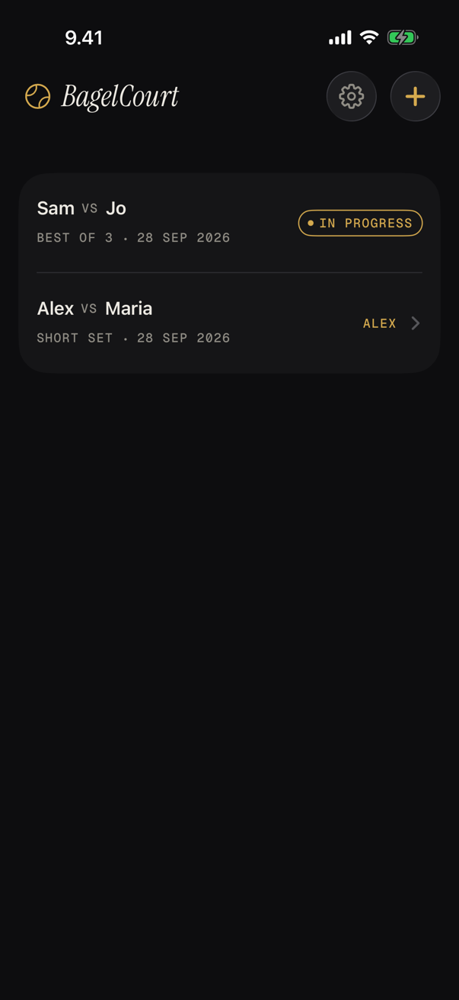
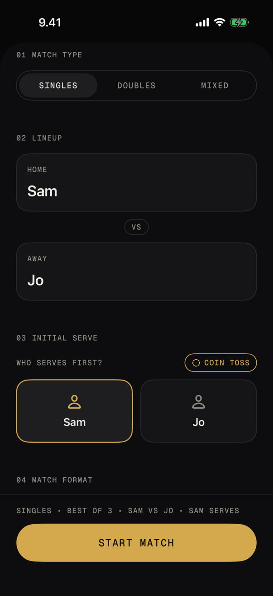
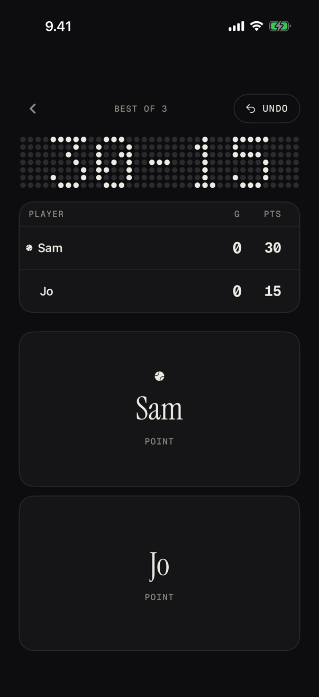
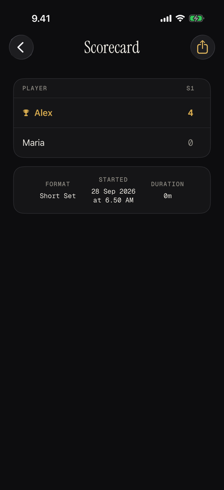

<p align="center">
  
</p>

<h1 align="center">BagelCourt</h1>

<p align="center">A tennis scorekeeper for iPhone. You tap who won the point, and the app keeps the score.</p>

<p align="center">
  
  
  
  
</p>

BagelCourt keeps score for singles and doubles. It follows the rules for you: deuce and advantage, tiebreaks, who serves next, and when a set or the match is over. It works offline, doesn't need an account, and stores your matches on the device.

The name comes from tennis slang: a bagel is a set won 6-0.

## Features

- Singles, doubles and mixed matches.
- Best of three sets, a single set, an eight-game pro set, a four-game short set, or your own number of games per set and tiebreak score.
- An optional 10-point match tiebreak in place of the final set in best-of-three matches.
- A coin toss to decide who serves first.
- Undo as many points as you like, including across games, sets and the end of the match.
- A dot-matrix board on the match screen that shows the current game score in large type.
- Different haptics for winning a point, a game, a set and the match.
- Match history, with an offer to resume a match you left unfinished.
- A scorecard for each finished match that you can share as an image.

## Requirements

- Xcode 26 or later
- iOS 26.5 or later

There are no third-party dependencies.

## Getting started

```sh
git clone https://github.com/muslimalfatih/bagel-court.git
cd bagel-court
open BagelCourt.xcodeproj
```

Pick the BagelCourt scheme and an iPhone simulator, then press Cmd+R.

To run it on your own iPhone, choose your team under Signing & Capabilities. If Xcode can't register the bundle identifier (`com.muslimalfatih.bagelcourt`), change it to one your team owns.

## Running the tests

The scoring engine and the dot-matrix board have unit tests written with Swift Testing. Cmd+U in Xcode runs them along with the UI tests. From the command line:

```sh
xcodebuild test \
  -project BagelCourt.xcodeproj \
  -scheme BagelCourt \
  -destination 'platform=iOS Simulator,name=iPhone 17 Pro' \
  -only-testing:BagelCourtTests
```

## How it works

The scoring rules are in `BagelCourt/Engine` and don't depend on SwiftUI or SwiftData. A `Match` stores its setup (players, format, first server) and the list of points in the order they were won. The score, the server, finished sets and the winner are all worked out by replaying that list through `MatchState`. Undo removes the last point and replays the rest, so it can't leave the score in a state the rules wouldn't allow.

Matches are saved with SwiftData. Each record holds the whole `Match` as JSON, so changing the engine doesn't require a database migration.

The screens are in `BagelCourt/App`. While a match is being played, `LiveMatchController` records each point, plays the haptic, saves the match and sends the score to the watch.

```
BagelCourt/
├── App/        screens, design system, persistence, watch bridge
├── Engine/     scoring rules
├── Watch/      watchOS views (no watchOS target yet)
└── Fonts/      bundled fonts and their licenses
BagelCourtTests/     unit tests (Swift Testing)
BagelCourtUITests/   UI tests (XCTest)
```

## Fonts

Titles use Instrument Serif. Labels and numbers use Geist Mono. Both are licensed under the SIL Open Font License 1.1, and their license files are in `BagelCourt/Fonts`. Everything else uses the system font.

## Not done yet

- A watchOS target. The phone already sends score updates over WatchConnectivity, and the watch views are in `BagelCourt/Watch`, but nothing builds them yet.
- Scoring from the watch.
- No-ad scoring.
- Removing the early prototype files (`TennisMatch.swift`, `LiveScoreView.swift` and `MatchSetupView.swift`), which the app no longer uses.

## Contributing

Issues and pull requests are welcome. For anything larger than a small fix, please open an issue first so we can agree on the approach.

A few guidelines:

- Changes to the scoring rules need a test in `BagelCourtTests/MatchEngineTests.swift` that fails without the change.
- Code in `Engine/` shouldn't import SwiftUI or SwiftData.
- Run the tests before opening a pull request.

Bug reports are easiest to act on when they include the match format, the points played and the score you expected to see.

## License

BagelCourt is released under the MIT License. See [LICENSE](LICENSE). The bundled fonts are covered by their own license, the SIL Open Font License 1.1.
